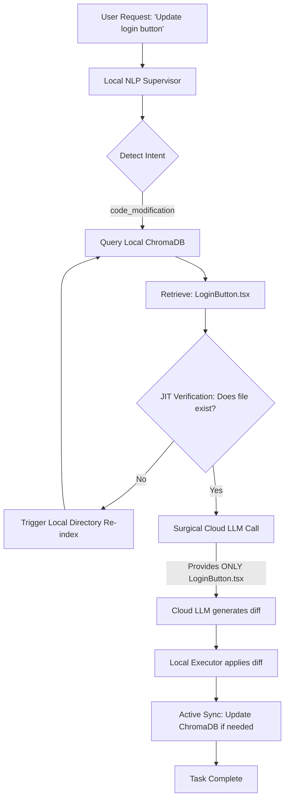

# Ecogent Coding Agent: The Semantic Code Map Architecture

*Note: This document describes the planned architecture for the Ecogent Coding Agent, designed to solve the critical flaws in current state-of-the-art coding agents.*

---

## 1. The Core Problem with Current Coding Agents

Current coding agents (like Devin, Cursor, or open-source equivalents) suffer from a major architectural flaw: **Context Bloat and Spatial Amnesia.**

When a user asks a standard agent to make a small change (e.g., *"Change the login button to be disabled while loading"*), the agent typically:
1. Runs expensive recursive `ls` or `grep` commands to search the entire repository.
2. Gets confused by multiple files with similar names (e.g., 5 different `button.tsx` files).
3. Hallucinates folder paths because it lacks persistent spatial memory.
4. Passes massive amounts of irrelevant project architecture into the LLM context window.

**The Result:** A 2-line code update costs as many API tokens (and takes as much time) as writing the entire file from scratch, because the agent re-discovers the codebase on every single prompt.

---

## 2. The Ecogent Solution: Semantic Code Map

Ecogent solves this by giving the agent persistent spatial memory using a **Semantic Code Map** stored in a local Vector Database (ChromaDB).

Instead of starting blind on every turn, the agent queries the local database to find exactly where a feature lives, and passes *only* that specific file context to the expensive Cloud LLM.

### How It Works

#### A. Initial Generation (Building the Map)
When the Ecogent Coding Agent writes new code, it automatically generates a tiny JSON metadata entry and saves it to ChromaDB.

**Example Entry:**
```json
{
  "component_name": "Login Button",
  "description": "Primary authentication button component handling user login state",
  "file_path": "frontend/src/components/LoginButton.tsx",
  "dependencies": ["auth_service.ts", "ui_theme.css"],
  "tools_required": ["edit_react_component"]
}
```

#### B. The Follow-Up Request (Zero-Search Execution)
When the user asks for a modification later:

1. **User:** *"Update the login button to show a spinner."*
2. **Local Supervisor:** Detects intent (`code_modification`) and target (`"login button"`).
3. **Local Retrieval (Zero Cost):** The local agent queries ChromaDB for "login button". Chroma instantly returns the exact `file_path` (`frontend/src/components/LoginButton.tsx`).
4. **Surgical Escalation:** The Cloud LLM is invoked, but it is ONLY given the contents of `LoginButton.tsx` and the exact tool needed to edit it.

**Benefit:** Zero hallucination, zero wasted search time, and a massive reduction in token consumption.

---

## 3. The Ecogent Sync Layer (Solving Cache Invalidation)

A critical challenge with Semantic Maps is **Semantic Drift** (or Cache Invalidation) — what happens if a human developer manually renames or deletes a file, but the Vector DB still points to the old location?

Ecogent utilizes a three-tiered **Sync Layer** to ensure the agent's memory always matches reality, without incurring cloud API costs:

### Tier 1: Active Sync (The Self-Aware Tool)
When the Ecogent agent itself executes a tool (e.g., `rename_file` or `delete_component`), the Python tool script is hardcoded to automatically update or remove the corresponding ChromaDB entry as its final step. 
*(Cost: 0 tokens)*

### Tier 2: Passive Sync (The Background Watcher)
If a human edits code in VS Code, Ecogent's Local OS Agent runs a lightweight background `watchdog` process. When a file is saved, a tiny, fast local embedding model (like `all-MiniLM-L6-v2` running on CPU) recalculates the embedding for just that one changed file and silently updates ChromaDB.
*(Cost: 0 cloud tokens, negligible local CPU)*

### Tier 3: Just-In-Time (JIT) Verification
Right before the Local Supervisor hands a file path to the Cloud LLM, it runs a split-second OS sanity check:
`os.path.exists("frontend/src/components/LoginButton.tsx")`
If the file is missing, the system aborts the cloud call and triggers a fast local re-index of the directory to repair the map before proceeding.

---

## 4. Architecture Flow Diagram



---

## 5. Summary of Advantages

| Feature | Standard Coding Agent | Ecogent Coding Agent |
|---------|-----------------------|----------------------|
| **File Discovery** | Recursive `ls` / `grep` (Expensive, slow) | Semantic Vector Retrieval (Instant, free) |
| **Context Window** | Bloated with full project architecture | Minimal (Only the target file is sent) |
| **Path Hallucination** | High (frequently invents non-existent paths) | Zero (Paths are hard-linked in DB) |
| **Cost to Modify Code**| High (Re-reads codebase every prompt) | Ultra-Low (Surgical updates) |
